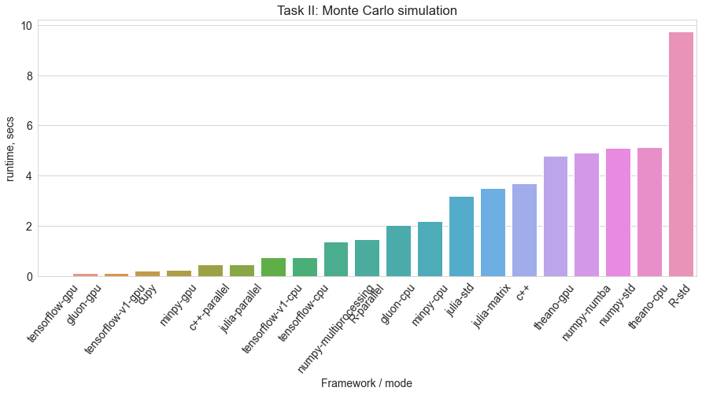

# Computational & Deep Learning Frameworks Benchmark on real-world tasks

Frameworks compared:
* [Python 3](https://www.python.org/)/[Numpy](http://www.numpy.org/) with or without [Numba JIT compilation](http://numba.pydata.org/)
* [Julia](https://julialang.org/) The Julia Programming Language
* C++ called from Python using [pybind11](https://github.com/pybind/pybind11)
* [Tensorflow](https://www.tensorflow.org) v1 in CPU/GPU mode
* [Theano](http://deeplearning.net/software/theano)
* [MinPy](https://github.com/dmlc/minpy) a NumPy interface above [MXNet](http://mxnet.io) backend, in CPU/GPU mode
* [Gluon](https://gluon.mxnet.io/) library in Apache [MXNet](http://mxnet.io), CPU/GPU mode
* [CuPy](https://cupy.chainer.org/) an open-source matrix library accelerated with NVIDIA CUDA.
* [R](https://www.r-project.org/) Project for Statistical Computing

# Tasks:
## Task I: Time-series model (GARCH / *Scan* operation  benchmark)

## Task II: Monte Carlo simulation (Barrier option pricing)

## Task III: Logistic regression using Hybrid Monte Carlo (HMC)
